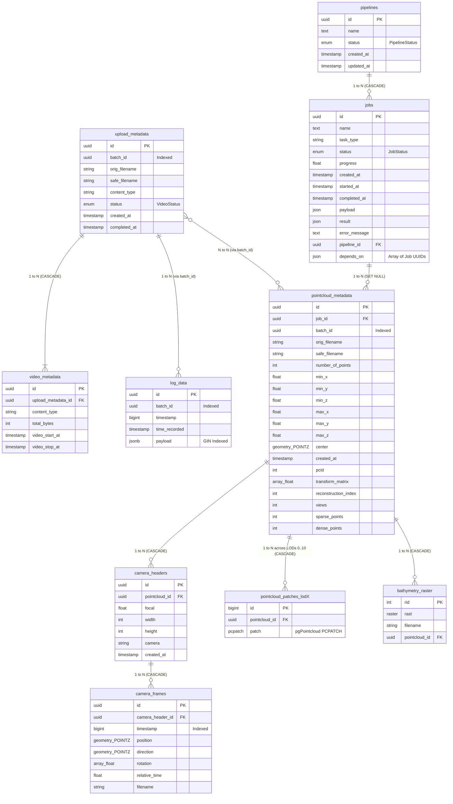

# Database Schema & Relations

This document details the PostgreSQL database schema, spatial/point-cloud extensions, dynamic table structures, and entity relationships within the SeaSee-r backend architecture.

---

## Overview & Database Extensions

The SeaSee-r backend relies on PostgreSQL extended with geospatial and point cloud capabilities:

| Extension | Purpose | Key Usage |
| :--- | :--- | :--- |
| **`postgis`** | 3D Spatial geometry types (`POINTZ`), spatial indexing, and coordinate transformations | Camera frame positions (`POINTZ`), camera direction vectors, point cloud center points |
| **`postgis_raster`** | Raster data storage and manipulation | `bathymetry_raster.rast` |
| **`pointcloud`** | Compressed point cloud patch storage (`PCPATCH`) | Dynamic Multi-LOD point cloud tables (`pointcloud_patches_lod0` .. `lod10`) |
| **`pointcloud_postgis`** | Interoperability between `PCPATCH` and PostGIS geometries | Spatial filtering and conversion functions |

---

## Entity Relationship Diagram (ERD)

---

## Detailed Table Specifications

### 1. Ingestion & Video Data

#### `upload_metadata` ([models/video.py](file:///home/tastegger/Documents/SeaSee-r/backend/app/models/video.py))
Tracks user uploads and video processing batches.
- `id` (`UUID`, PK): Unique upload identifier.
- `batch_id` (`UUID`, Indexed, Nullable): Batch identifier grouping multiple uploads and linking them to reconstructions (`pointcloud_metadata`) and telemetry (`log_data`) in N-N / 1-N relationships.
- `orig_filename` (`String(255)`): Original uploaded filename.
- `safe_filename` (`String(255)`, Nullable): Sanitized filesystem filename.
- `content_type` (`String(100)`, Nullable): MIME type (e.g. `video/mp4`).
- `status` (`Enum(VideoStatus)`): `PENDING`, `UPLOADING`, `COMPLETED`, `FAILED`.
- `created_at` / `completed_at` (`DateTime(timezone=True)`): Timestamps.

#### `video_metadata` ([models/video.py](file:///home/tastegger/Documents/SeaSee-r/backend/app/models/video.py))
Stores actual video clip interval boundaries and metadata linked to an upload batch.
- `id` (`UUID`, PK): Primary identifier.
- `upload_metadata_id` (`UUID`, FK -> `upload_metadata.id` ON DELETE CASCADE): Links back to parent upload.
- `content_type` (`String(100)`): Video media type.
- `total_bytes` (`Integer`): Size of video in bytes.
- `video_start_at` / `video_stop_at` (`DateTime(timezone=True)`): Epoch timestamps bounding video recording time.

#### `log_data` ([models/log_data.py](file:///home/tastegger/Documents/SeaSee-r/backend/app/models/log_data.py))
Chronological sensor log telemetry associated with an upload batch.
- `id` (`UUID`, PK): Primary identifier.
- `batch_id` (`UUID`, Indexed, Nullable): Grouping identifier linking telemetry to upload batch.
- `timestamp` (`BigInteger`, Indexed): Epoch millisecond timestamp.
- `time_recorded` (`DateTime(timezone=True)`, Indexed): Formatted recorded timestamp.
- `payload` (`JSONB`): Unstructured sensor payload. Indexed with GIN (`ix_log_data_payload`).

---

### 2. Job & Pipeline Management

#### `pipelines` ([models/job.py](file:///home/tastegger/Documents/SeaSee-r/backend/app/models/job.py))
Grouping construct for DAG processing workflows.
- `id` (`UUID`, PK): Pipeline identifier.
- `name` (`Text`): Human-readable pipeline description.
- `status` (`Enum(PipelineStatus)`): `PENDING`, `RUNNING`, `COMPLETED`, `FAILED`, `CANCELLED`.
- `created_at` / `updated_at` (`DateTime(timezone=True)`).

#### `jobs` ([models/job.py](file:///home/tastegger/Documents/SeaSee-r/backend/app/models/job.py))
Individual processing tasks within a pipeline.
- `id` (`UUID`, PK): Job identifier.
- `name` (`Text`): Task name (e.g. `OpenSfM Sparse Reconstruction`).
- `task_type` (`String(100)`): Worker handler task routing type.
- `status` (`Enum(JobStatus)`): `PENDING`, `BLOCKED`, `RUNNING`, `COMPLETED`, `FAILED`, `CANCELLED`.
- `progress` (`Float`): Progress completion percentage `[0.0, 100.0]`.
- `payload` / `result` (`JSON`): Input payload and output state.
- `error_message` (`Text`): Error summary if failed.
- `pipeline_id` (`UUID`, FK -> `pipelines.id` ON DELETE CASCADE, Nullable): Parent pipeline.
- `depends_on` (`JSON`): List of antecedent job UUID strings enforcing DAG dependency execution order.

---

### 3. Point Cloud & Spatial Data

#### `pointcloud_metadata` ([models/pointcloud.py](file:///home/tastegger/Documents/SeaSee-r/backend/app/models/pointcloud.py))
Master index of processed 3D point clouds.
- `id` (`UUID`, PK): Point cloud dataset ID.
- `job_id` (`UUID`, FK -> `jobs.id` ON DELETE SET NULL, Nullable): Job that generated this point cloud.
- `batch_id` (`UUID`, Indexed, Nullable): Batch identifier linking point cloud datasets to upload metadata in an N-N relationship (supports 1 video split into multiple files and generating multiple reconstruction point clouds).
- `orig_filename` / `safe_filename` (`String(255)`): Filename references.
- `number_of_points` (`Integer`): Total 3D point count.
- `min_x`, `min_y`, `min_z`, `max_x`, `max_y`, `max_z` (`Float`): Bounding box bounds.
- `center` (`Geometry(POINTZ, srid=4326)`): Centroid point in spatial reference system.
- `created_at` (`DateTime(timezone=True)`): Creation timestamp.
- `pcid` (`Integer`): Schema identifier registered in pgPointcloud `pointcloud_formats`.
- `transform_matrix` (`ARRAY(Float)`): 4x4 coordinate transformation matrix.
- `reconstruction_index` (`Integer`, Default `0`, Nullable): Component index of OpenSfM reconstruction.
- `views` (`Integer`, Nullable): Number of camera view shots included in the reconstruction component.
- `sparse_points` (`Integer`, Nullable): Count of sparse 3D point features.
- `dense_points` (`Integer`, Nullable): Count of dense 3D points generated from depthmap fusion.

#### `pointcloud_patches_lod0` through `pointcloud_patches_lod10` ([models/pointcloud.py](file:///home/tastegger/Documents/SeaSee-r/backend/app/models/pointcloud.py))
Dynamically generated Level-Of-Detail (LOD) tables (`PointCloudPatchLOD0` .. `PointCloudPatchLOD10`).
- `id` (`BigInteger`, PK, Autoincrement): Patch ID.
- `pointcloud_id` (`UUID`, FK -> `pointcloud_metadata.id` ON DELETE CASCADE, Indexed): Associated dataset.
- `patch` (`PCPATCH`): Compressed point cloud patch block.

#### `camera_headers` ([models/camera.py](file:///home/tastegger/Documents/SeaSee-r/backend/app/models/camera.py))
Intrinsic camera calibration parameters per reconstructed dataset.
- `id` (`UUID`, PK): Header ID.
- `pointcloud_id` (`UUID`, FK -> `pointcloud_metadata.id` ON DELETE CASCADE): Parent point cloud dataset.
- `focal` (`Float`): Focal length.
- `width` / `height` (`Integer`): Frame resolution.
- `camera` (`String(255)`): Camera lens/sensor model name.

#### `camera_frames` ([models/camera.py](file:///home/tastegger/Documents/SeaSee-r/backend/app/models/camera.py))
Extrinsic camera pose trajectory for each frame.
- `id` (`UUID`, PK): Frame ID.
- `camera_header_id` (`UUID`, FK -> `camera_headers.id` ON DELETE CASCADE, Indexed): Calibration header.
- `timestamp` (`BigInteger`, Indexed): Capture timestamp.
- `position` (`Geometry(POINTZ, srid=4326)`): 3D camera spatial position coordinates.
- `direction` (`Geometry(POINTZ, srid=4326)`): 3D camera viewing direction vector.
- `rotation` (`ARRAY(Float)`): 3D rotation representation.
- `relative_time` (`Float`): Elapsed relative time in seconds.
- `filename` (`String(255)`): Source image filename.

#### `bathymetry_raster` ([models/pointcloud.py](file:///home/tastegger/Documents/SeaSee-r/backend/app/models/pointcloud.py))
Rasterized depth grid generated from point cloud surface models.
- `rid` (`Integer`, PK, Autoincrement): Raster ID.
- `rast` (`Raster`): PostGIS raster tile data.
- `filename` (`String(255)`): Source raster file path.
- `pointcloud_id` (`UUID`, FK -> `pointcloud_metadata.id` ON DELETE CASCADE, Nullable): Parent point cloud dataset.

---

## Foreign Key Cascading Behavior Summary

| Parent Table | Child Table | Foreign Key Column | On Delete Action |
| :--- | :--- | :--- | :--- |
| `upload_metadata` | `video_metadata` | `upload_metadata_id` | `CASCADE` |
| `pipelines` | `jobs` | `pipeline_id` | `CASCADE` |
| `jobs` | `pointcloud_metadata` | `job_id` | `SET NULL` |
| `pointcloud_metadata` | `camera_headers` | `pointcloud_id` | `CASCADE` |
| `camera_headers` | `camera_frames` | `camera_header_id` | `CASCADE` |
| `pointcloud_metadata` | `pointcloud_patches_lod{0..10}` | `pointcloud_id` | `CASCADE` |
| `pointcloud_metadata` | `bathymetry_raster` | `pointcloud_id` | `CASCADE` |

> Note: `upload_metadata`, `pointcloud_metadata`, and `log_data` are associated via the shared `batch_id` column rather than direct foreign keys, providing flexible N:N relations for multi-file video uploads and multiple reconstruction point clouds per batch.

