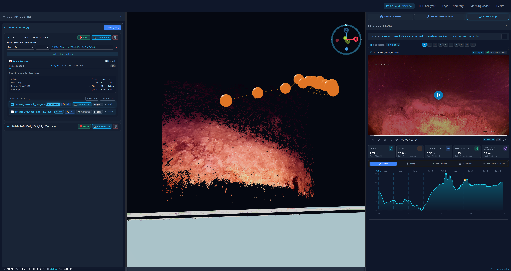
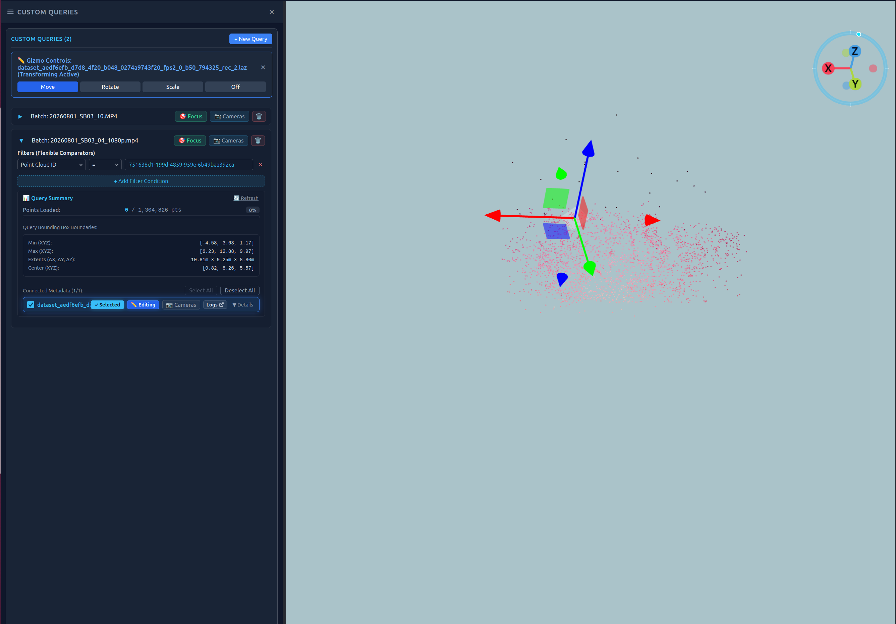
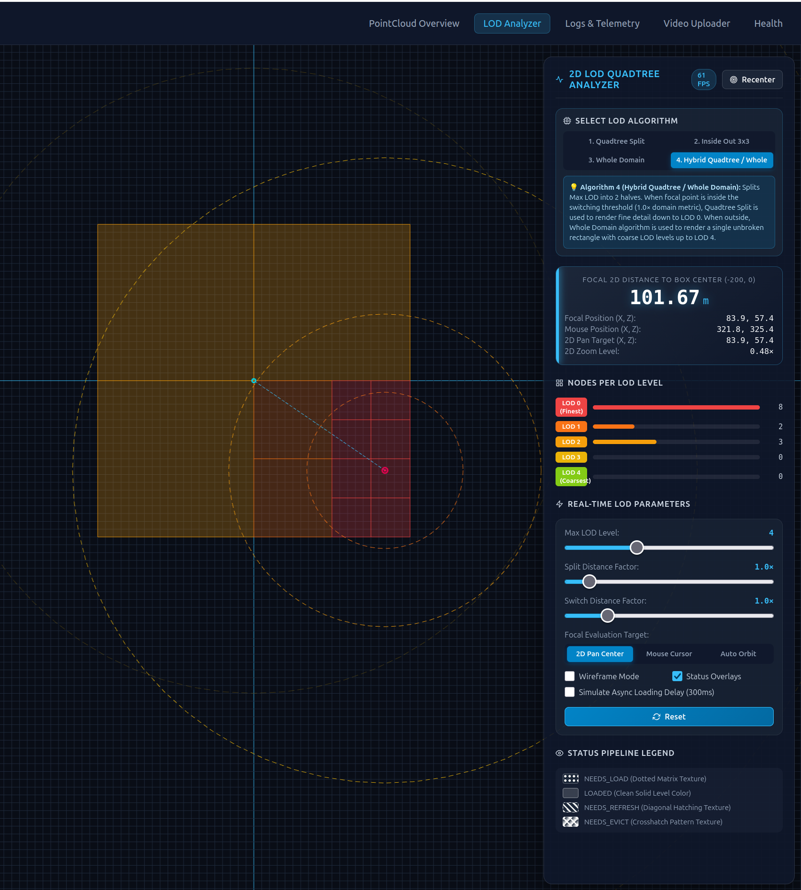
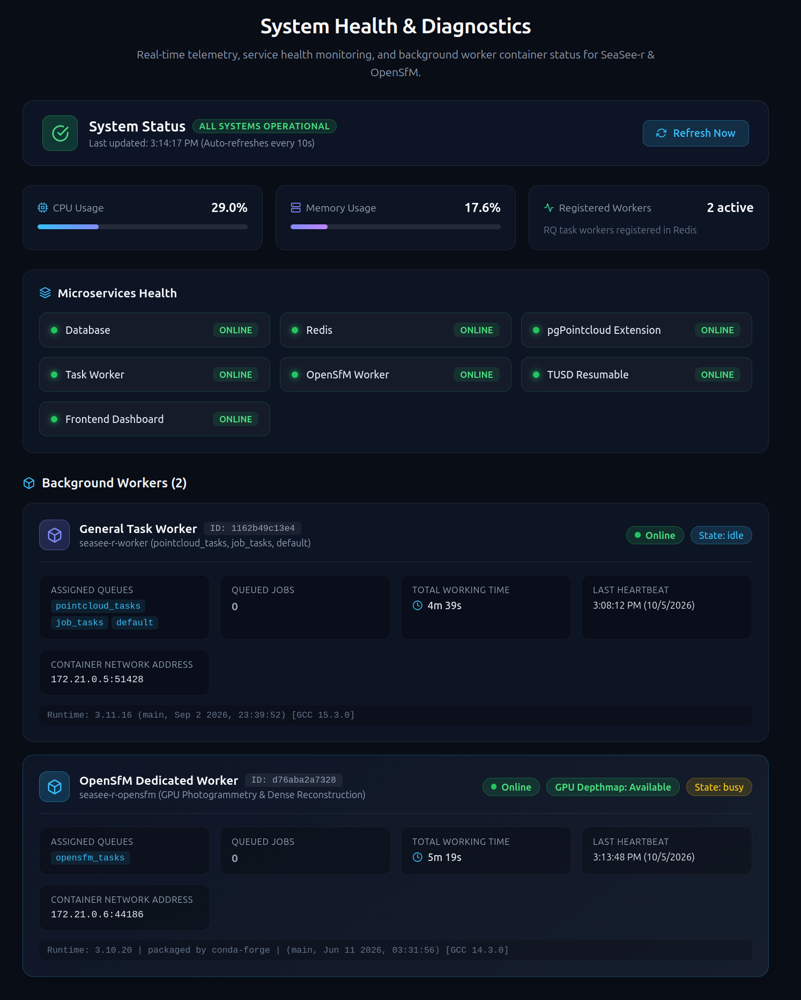
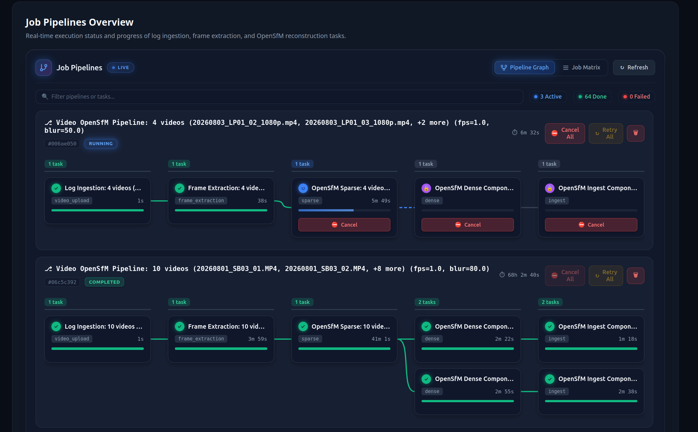

# SeaSee-r UI & System Screenshots

This directory contains screenshots showcasing the primary user interfaces, 3D visualization capabilities, job scheduling systems, and diagnostic tools developed for SeaSee-r.

---

## 1. Point Cloud Overview (Viewer & Synced Telemetry)

- **Description**: Overview of the interactive 3D Point Cloud viewer integrated with the synchronized Video & Telemetry panel. Displays high-density bathymetric point cloud data alongside custom query filters, loaded point metrics, bounding box coordinates, and time-aligned dive telemetry charts (depth profile, temperature, sonar altitude, and calculated distance).

---

## 2. Point Cloud Overview (Camera Routes)

- **Description**: Point Cloud Overview displaying camera-routes. Visualizes the reconstructed underwater camera trajectory with spherical waypoint markers and orientation cones directly overlaid on the seabed point cloud, synchronized with frame-by-frame video playback and sensor logs.

---

## 3. Point Cloud Overview (Transform Gizmo / Edit Mode)

- **Description**: Point Cloud editing and spatial manipulation mode. Features active 3D Gizmo controls (translation/move, rotation, and scaling) anchored to the active point cloud batch to allow manual spatial alignment, coordinate transformation, and point cluster inspection.

---

## 4. 2D LOD Quadtree Analyzer

- **Description**: Interactive 2D Level of Detail (LOD) Quadtree Analyzer testing the Hybrid Quadtree / Whole Domain algorithm. Displays spatial subdivision cells relative to camera focal distance, node counts per LOD level (LOD 0 finest to LOD 4 coarsest), real-time distance tuning sliders, and tile caching/eviction pipeline state overlays.

---

## 5. System Health & Diagnostics

- **Description**: Real-time System Health & Diagnostics dashboard monitoring system metrics (CPU, RAM usage), operational health across core microservices (PostgreSQL with PostGIS/pgPointcloud, Redis, Task Workers, OpenSfM Worker, and TUSD resumable upload server), and detailed background worker status.

---

## 6. Job Pipeline Overview

- **Description**: Job Pipelines Overview visualizing asynchronous photogrammetry and processing pipelines in a live Directed Acyclic Graph (DAG). Displays real-time progress bars, step execution timing, inter-job dependency chains, and lifecycle controls (cancel, retry, prune) across log ingestion, frame extraction, OpenSfM sparse/dense reconstruction, and database ingestion.
