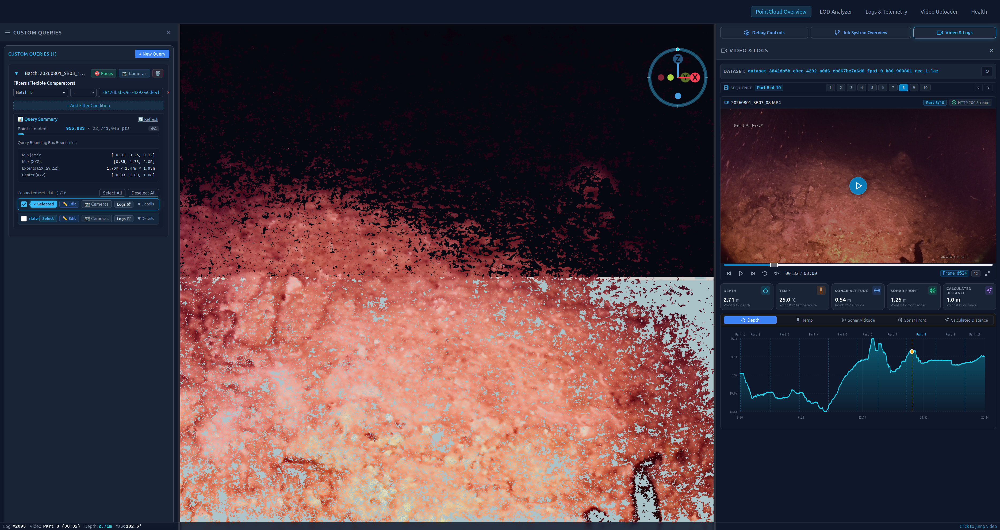

# SeaSee-r

A system to ingest, explore, and plan operations for ROV systems in marine environments.



_For additional interface previews and system views, see the [Screenshots Overview](./GSoC_Notes/6_Screenshots/README.md)._

## Getting Started

Follow these steps to set up and start the system from a fresh clone.

### 1. Download Git Submodules

```bash
git submodule update --init openSfM/openSfM_core seaseer-dashboard/public/geo-three
```

### 2. Configure Environment

Create and edit your `.env` configuration file:

```bash
cp .env.example .env
```

### 3. Install & Hook NVIDIA Container Toolkit (Ubuntu)

GPU acceleration requires the NVIDIA Container Toolkit configured for Docker (see [Docker Setup Guide](./GSoC_Notes/3_Documentation/Docker_Setup.md))

### 4. Build and Run Services

Build and launch all services via Docker Compose:

```bash
docker compose up -d --build
```

### Endpoints

- **Frontend Dashboard**: [http://localhost:3000](http://localhost:3000)
- **API Documentation**: [http://localhost:8000/docs](http://localhost:8000/docs)
- **TUS Upload Server**: [http://localhost:8080/files/](http://localhost:8080/files/)

## Documentation

- [Documentation Index](./GSoC_Notes/3_Documentation/00_Index.md): Technical documentation, architecture overviews, and guides.
- [Project Status & Roadmap](./PROJECT_STATUS.md): Summary of implemented features, architectures, and future improvements.
- [Screenshots Overview](./GSoC_Notes/6_Screenshots/README.md): Visual walkthrough of UI features, point cloud exploration, camera-route visualizations, and pipelines.

---

## Local Installation (Deprecated)

> [!NOTE]
> This installation script was used in the past to configure host Conda environments, but is **no longer required** to set up or run the project (all services now run in Docker).

The legacy setup script automatically:
- Initialized and downloaded all Git submodules.
- Installed Miniconda locally.
- Created and configured the `opensfm` Conda environment.
- Created and configured the `pyslam` Conda environment.

Legacy command:
```bash
./install_all.sh
```